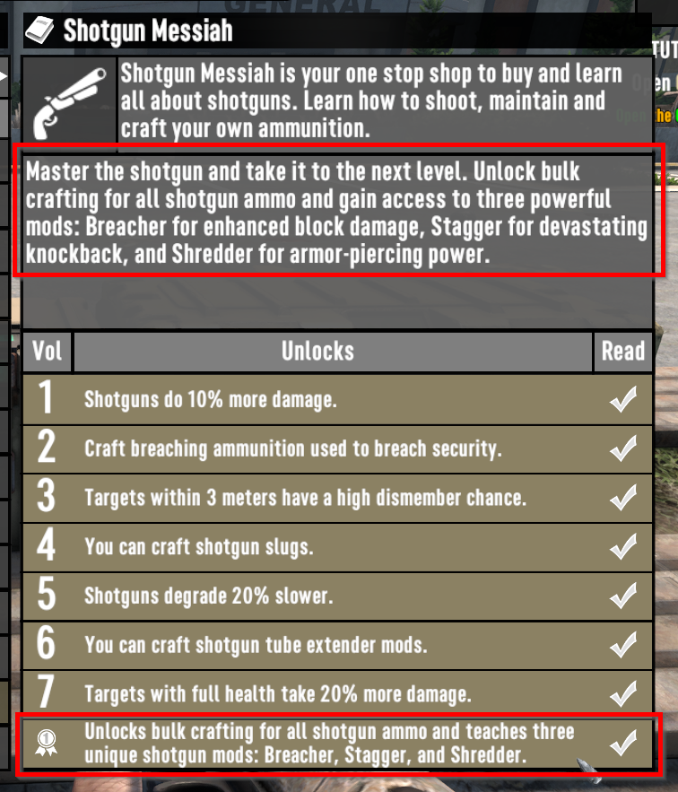
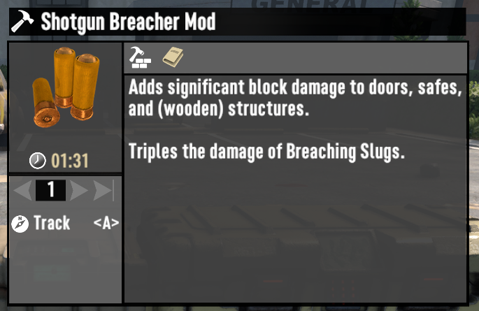
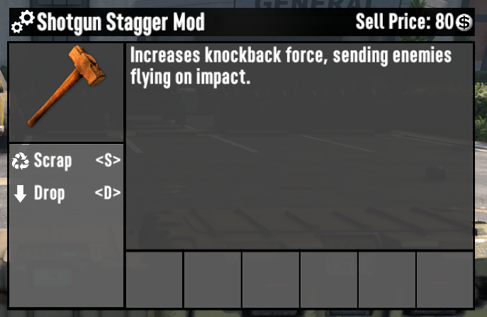
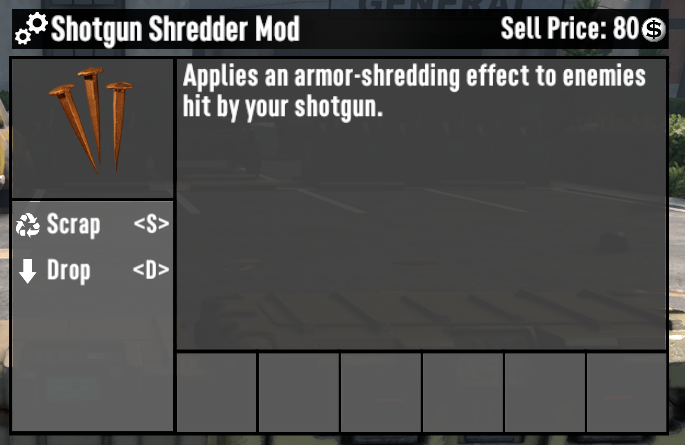

# ISI Shotgun Specialist

> Enhance your shotgun arsenal and dominate the apocalypse with style!

Some players despise the "one shot most wood blocks" perk from completing the Shotgun Messiah book series, but it's necessary if they want the other perks (such as the ability to craft shotgun ammo in bulk).

This mod moves that perk to one of three new craftable mods that are unlocked by completing Shotgun Messiah, giving players the ability to pick which perk they want.

- **Breacher** – Deal extra damage to doors, safes, and wood blocks. Triples the power of Breaching Slugs.
- **Stagger** – Launch enemies with devastating knockback.
- **Shredder** – Shreds enemy armor on impact.

## Screenshots

### Shotgun Messiah - Completion

### New Mods

### Breacher Damage

### Stagger Effect

### Shredder Damage

## Testing

1. **Shotgun Messiah Completion**
   - Read all Shotgun Messiah books
   - Verify Breacher, Stagger, and Shredder mods unlock in crafting

2. **Breacher Mod Testing**
   - Craft and install Breacher mod on shotgun
   - Test damage against doors, safes, and wood blocks
   - Verify Breaching Slugs deal triple damage with mod equipped

3. **Stagger Mod Testing**
   - Craft and install Stagger mod on shotgun
   - Shoot zombies to confirm knockback effect
   - Test on different enemy types and sizes

4. **Shredder Mod Testing**
   - Craft and install Shredder mod on shotgun
   - Shoot armored enemies (soldiers) to verify armor penetration
   - Compare damage with and without mod
